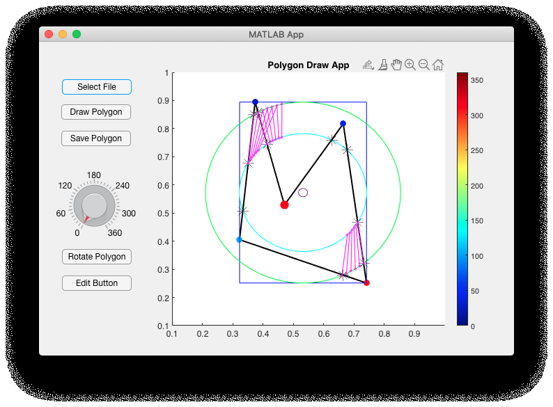

# Polygon Draw App

**3rd Party Libraries Used:** Image Processing Toolbox, Mapping Toolbox\
drawpolygon() polyxpoly(), linecirc()\
**Blue Bold Text:** The file the code being referenced can be found in.

##

